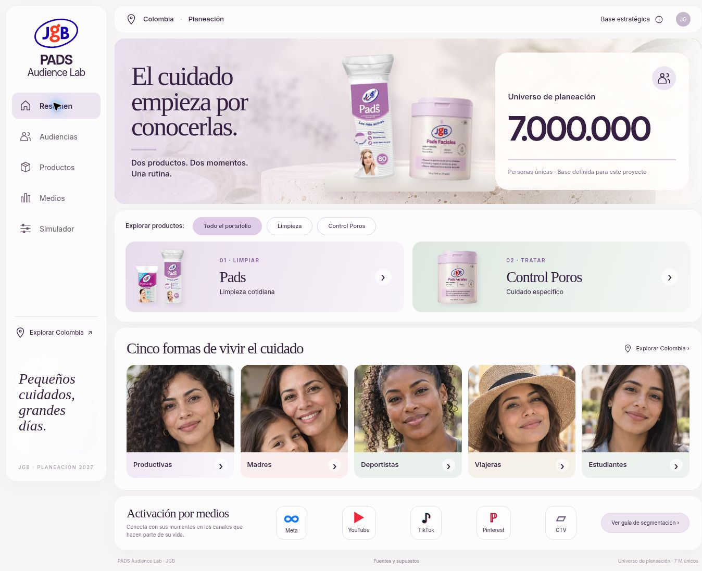

# PADS Audience Lab · JGB

Plataforma independiente de planeación de audiencias para PADS JGB en Colombia. Diseño **A · Skin Lab**: marfil, lavanda y salvia; empaques originales y fotografías ilustrativas.

Sitio: https://pads-fawn.vercel.app/

Repositorio: https://github.com/santiagoherrera1886-ai/Pads

## Secciones funcionales

- Resumen: universo nacional de comunicación de 30 M, precio analizado por separado y enfoque de 18+ para todos los géneros.
- Universo: cadena matemática auditable desde DANE 2027 (población 18+, edad y sexo), tasas TIC 2025 y coeficientes de planeación; análisis separado del ticket medio fijo de $70.000.
- Audiencias: cinco contextos del brief ampliados a hombres y mujeres, búsqueda, mensajes, señales sugeridas y exportación CSV contextual.
- Productos: Pads de limpieza y Pads Control Poros, comparativa y navegación al público o medio correspondiente.
- Medios: guías contextuales de Meta, YouTube, TikTok, Pinterest y CTV, con selección de público/producto, fuentes y copia/descarga.
- Colombia: contorno nacional y cinco clústeres por afinidad, sin segmentación por ciudades.
- Simulador: reparto exclusivo entre solo limpieza, ambas líneas y solo Control Poros; inversión, CPM y mezcla editables; 12 olas, alcance deduplicado, frecuencia, persistencia local y CSV.

**Universo de categoría combinado con límite estricto: 7 millones de personas únicas entre ambas líneas**, después del overlap. El escenario predeterminado parte de **Pads normales: 4,5 M** (2,1 M compradores actuales + 2,4 M audiencia nueva) y **Pads Control Poros: 2,5 M** (600.000 compradores actuales + 1,9 M nueva audiencia). Con **10% de overlap de la audiencia menor**, comparten 250.000 personas y la suma deduplicada es **6,75 M únicos**; con overlap del 0%, la suma teórica sería 7 M. La composición de categoría y su overlap están **fijos en la interfaz, sin campos de edición ni controles deslizantes**; son supuestos de planeación, no cifras medidas de compradores.

**Cinco perfiles beauty vinculados a los universos de origen**: Vida laboral / Beauty after work, Madres y padres / Self-care sofisticado, Deportistas / Active beauty, Viajes / Beauty on the go, Estudiantes / Beauty discovery 18+. Cada tarjeta incluye cuatro tamaños de público (compradores actuales y nueva audiencia de cada producto) calculados a partir de participaciones hipotéticas. Al abrirla se ven los intereses premium de cada combinación, qué porcentaje representa de su cohorte nacional, medios, búsquedas de contenido y enfoque creativo. Una matriz de reconciliación debajo de las tarjetas muestra el total por fila y columna. Los perfiles son una **asignación primaria excluyente únicamente para modelado**, mientras los intereses en la realidad pueden coexistir, de modo que no se afirma un tamaño medido para cada interés ni se garantiza su disponibilidad en la plataforma.

La matriz también asigna a cada perfil una participación del overlap entre líneas, con la deduplicación calculada una sola vez, y permite exportar cantidades e intereses a CSV. Los valores están definidos en `PRODUCT_AUDIENCE_DEFAULT` y no se cargan desde `localStorage`: configuraciones antiguas de navegadores no pueden modificar las cifras publicadas. El simulador de medios sigue independiente de estas bases de categoría.

**Distinción metodológica**: los 30 M son un potencial nacional amplio de comunicación (no compradores de la categoría). El simulador de alcance por producto y sus 12 olas usa la misma base fija de **6,75 M**: 4,25 M solo Pads, 250.000 compartidos y 2,25 M solo Control Poros. Únicamente pueden variarse presupuesto, CPM supuesto y mezcla financiera; los universos no son editables. El modelo por producto descuenta **una sola vez** la intersección alcanzada, sin volver a restar otro 10%. La nueva sección de matemática permite visualizar otra sensibilidad independiente **por plataforma** sobre el mismo universo, sin sumar dos forecasts teóricos. [Metodología de medios](docs/buyer-segments.md).

## Datos y límites

El universo nacional de comunicación es **30 millones**, Colombia 18+, sin límite superior, todos los géneros. Parte de 39.721.750 adultos proyectados por DANE para 2027 y 33,27 M de potencial digital estimado al aplicar tasas TIC 2025 por edad constantes. Para 18–24 se aproxima con la tasa publicada de 12–24. Los 30 M incorporan un margen de planeación; no representan compradores ni alcance garantizado. [Método y fuentes](docs/market-methodology.md).

La referencia económica es un cálculo independiente: adultos 2027 × 41,3% de clase media/alta en todas las edades de 2025 ≈ 16,41 M. No cruza edad, ingresos e internet ni mide capacidad efectiva de compra. Las sensibilidades de 20%, 35% y 50% son hipótesis. El **ticket medio de $70.000 COP por transacción** es una premisa comercial fija, no el precio de cada SKU. La periodicidad de transacciones y los tamaños de las audiencias no se deducen del ticket.

**Trazabilidad DANE 2027:** P(18+) = Σ edades proyectadas por DANE = 39.721.750; D(2027) = Σ P(edad,2027) × tasa_TIC(edad,2025) = 33,27 M (estimación propia); C = D × k_comunicación = 30 M (coeficiente estratégico); U_PADS = 4,5 M + 2,5 M − 0,25 M = 6,75 M (hipótesis de categoría fija). La relación U_PADS/C = 22,5% es **un coeficiente inverso por construcción**, no una penetración observada en DANE. El 41,3% de clases media/alta GEIH 2025 aplicado a población adulta 2027 es una proxy independiente de ingresos: no se multiplica por la tasa TIC sin datos cruzados. La plataforma añade sensibilidad digital ±5 p.p., límites de Fréchet para intersección ingreso-digital, y ticket medio 70 mil: gasto_mensual = ticket/meses; ingreso_aritmético = gasto_mensual/(presupuesto%/100). [Metodología DANE y ticket](docs/market-methodology.md). Se usa el mismo marco resumido en todas las secciones y el cálculo detallado en Universo.

El simulador parte de **6,75 M únicos de categoría**, inversión hipotética de **$100 M COP** y un **CPM global supuesto de $8.000 COP**. Presenta fórmulas de Poisson por producto, curva de 12 olas, alcance único, frecuencia e intersección alcanzada. El universo no admite edición. Ajustar la inversión o el CPM no cambia las bases demográficas ni implica previsión de un medio real.

**Matemática por plataformas y clústeres:** en las secciones Audiencias y Simulador se incluye «La matemática detrás de cada audiencia», con indicadores de trazabilidad, índices editoriales por Meta, YouTube, TikTok, Pinterest y CTV; fórmula explícita de mix de inversión; 12 olas por medio, límites de deduplicación y exportación CSV de ecuaciones, pesos y curvas. Los índices **son calificaciones estratégicas 1–5**, no conteos de usuarios de intereses ni métricas entregadas por plataformas. Todos los cálculos distinguen supuestos de mediciones observadas. [Revisión completa, fórmulas, prueba y fuentes](docs/math-methodology.md).

El brief anterior contiene 13,7 M, $400 M y packs Cuadrados/Redondos. No se trasladan esas cifras al nuevo proyecto. El PDF describe usos con diferencias de frecuencia, por lo que no se publican indicaciones de aplicación ni promesas clínicas adicionales.

## Ejecutar

Sitio estático, sin dependencias de aplicación ni servidor de datos:

```sh
python3 -m http.server 4174
npm test
```

Abrir la raíz del servidor. No abrir directamente con file:// porque se utilizan módulos JavaScript.

Vercel: framework Other, raíz del repositorio, sin instalación ni compilación, salida `.`. La configuración está en `vercel.json`. GitHub está conectado al proyecto Vercel `pads`, independiente de Ritual.

## Archivos

- `index.html`, `styles.css`, `app.js`: interfaz, diseño responsive, interacción y exportaciones.
- `src/brief.js`: productos, públicos y medios; páginas del brief de origen.
- `src/guides.js`: guías de activación y fuentes.
- `src/universe.js`, `src/simulation.js`: modelo y deduplicación.
- `src/product-audiences.js`, `src/product-audience-view.js`: universos por producto, cuatro públicos, overlap máximo de 10%, matriz y activación beauty.
- `src/cluster-intelligence.js`, `src/cluster-view.js`: asignación de los cuatro universos a cinco perfiles, matriz y despliegue detallado de intereses.
- `src/math-foundation.js`, `src/math-view.js`: fórmulas trazables, afinidad estratégica y simulación de saturación por cinco medios.
- `src/dane-audience-math.js`, `src/dane-audience-view.js`: procedencia DANE y análisis de sensibilidad TIC/ingresos, ticket medio fijo 70.000, trazabilidad por sección.
- `src/buyer-segments.js`, `src/buyer-view.js`: modelo previo conservado para sensibilidad de alcance en medios.
- `tests/`: pruebas del universo y simulador.
- `assets/SOURCES.md`: procedencia de los recursos.
- `docs/implementation.md`: decisiones y verificación.

## Vista publicada


