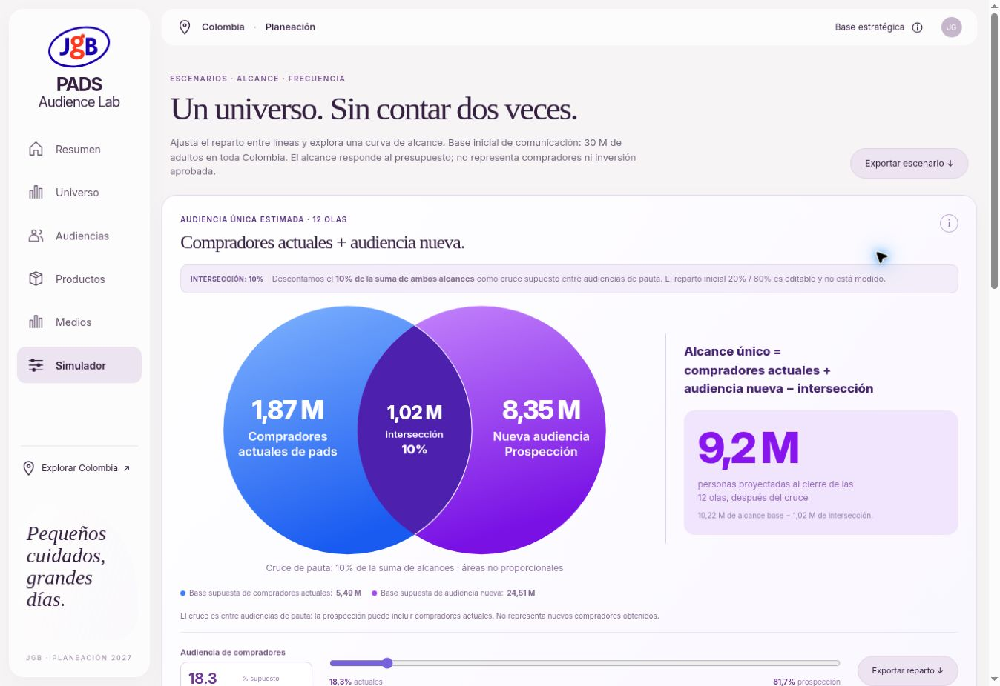

# Compradores actuales + audiencia nueva: cruce de alcance del 10%

Actualizado el 7 de octubre de 2026 a partir de la indicación de aplicar una intersección del 10% al alcance.

## Qué se cruza

En el simulador, los círculos representan audiencias de pauta: una orientada a quienes ya compran pads y otra de prospección para descubrir nueva audiencia. La prospección puede incluir compradores actuales. El 10% es una hipótesis de cruce entre esas estrategias, no un dato de compradores observado.

Universo y Audiencias conservan la composición potencial por estado de compra: compradores actuales y personas por incorporar a la categoría. Esos estados se excluyen por definición. La base nacional continúa en 30 M; no se descuenta el 10% de la población.

## Denominador y cálculo

El denominador es la **suma A + B de los dos alcances antes de descontar este cruce**. No es el 10% de la audiencia menor ni de la población nacional.

1. El modelo por producto calcula un alcance base R a partir de universo, presupuesto y CPM, con su propia intersección entre líneas.
2. Para esta sensibilidad adicional usamos R como suma bruta de las dos estrategias: A = R × reparto; B = R − A.
3. Intersección de audiencias I = R × 10%.
4. Alcance único ajustado = A + B − I = R × 90%.
5. Frecuencia ajustada = impresiones / alcance único ajustado; es cero cuando no hay alcance.

Este ajuste adicional de planeación no se deduce de los datos del modelo por producto ni constituye deduplicación observada. Las columnas de intersección entre productos y entre audiencias permanecen identificadas por separado.

Con la configuración de la captura (18,3% / 81,7%, inversión $100 M, CPM $8.000 y base 30 M), el alcance base es 10.222.781,09 aproximadamente: A ≈ 1,87 M, B ≈ 8,35 M, I ≈ 1,02 M y alcance ajustado ≈ 9,20 M. La frecuencia media ajustada se muestra como 1,4. Los cálculos usan precisión completa; los rótulos en millones redondean a dos decimales.

## Límites y persistencia

El reparto inicial 20% / 80% sigue siendo un ejemplo no medido. Se conserva el porcentaje válido guardado en `pads-buyers-v1`; la actualización no reemplaza un 18,3% guardado. No hay CRM ni cuentas de publicidad conectadas.

Una intersección no puede ser mayor que ninguna audiencia. Por eso el simulador limita el reparto a 10–90%. Las vistas de base potencial admiten 0–100%; si un porcentaje de allí resulta incompatible con el simulador, se muestra una explicación y un botón para restablecer 20% / 80%, sin inventar una intersección imposible.

La base no demuestra capacidad de pago, afinidad o disponibilidad de producto. El análisis del producto de $80.000 continúa por separado. El alcance de prospección no equivale a compradores adquiridos.

## Interfaz y exportación

El gráfico del simulador muestra círculos cruzados, valor de intersección y etiqueta 10%. Sus áreas no son proporcionales. El total, los indicadores, la curva ajustada, la tabla de 12 olas y los CSV aplican el mismo descuento. La curva de alcance base se conserva como referencia diferenciada.

Los CSV exportan denominador, porcentaje, alcances de cada estrategia, intersección y total ajustado. Para reconciliar personas enteras, se redondea el alcance base y el cruce; el alcance ajustado exportado es la diferencia exacta. La audiencia nueva es el resto de la suma bruta después de redondear compradores actuales.

Con inversión cero, ambos alcances, intersección, total ajustado y frecuencia son cero; las bases potenciales permanecen.

## Verificación

Pruebas del modelo: caso de la captura, límites 10–90%, rechazo de cruces imposibles, presupuesto cero, conservación de inversión y universo, frecuencia, 12 olas y conciliación exacta del CSV redondeado. 21 pruebas automatizadas pasan. La revisión de integración confirma persistencia del 18,3%, cruce de 1,02 M, alcance final de 9,20 M coherente entre gráfico/KPI/12 olas/CSV, presupuesto cero, diálogo de método, validación del límite 10–90% y recuperación de un reparto incompatible. La revisión visual de producción se registra al publicar.

Producción verificada: https://pads-fawn.vercel.app/#simulator, código `e230996458ab309a3b65033aadad7a1879175dd5`. Vercel confirmó despliegue completado. En navegador, reparto 18,3% / 81,7% muestra 1,87 M + 8,35 M − 1,02 M = 9,2 M; indicador y frecuencia de 1,4 coinciden. Inversión cero devuelve cero en alcance, intersección y frecuencia. El CSV descargado contiene las 12 olas y reconcilia exactamente el alcance final de 9.200.503 personas con una intersección de 1.022.278. No se registraron errores de consola del dominio. Revisión visual de escritorio; presupuesto restablecido a $100 M.

