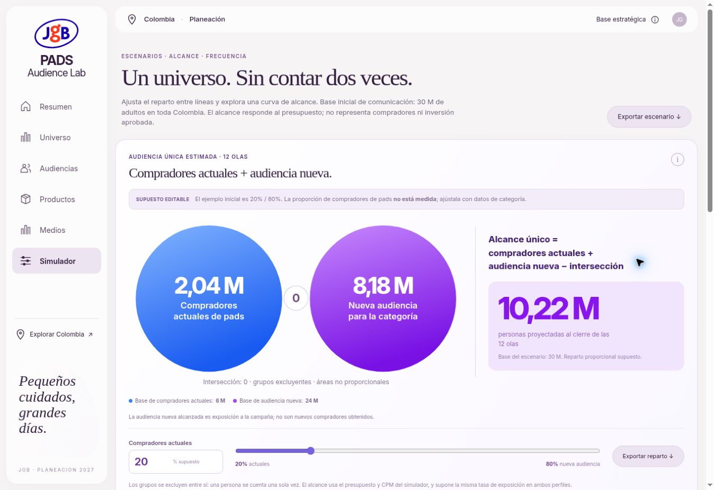

# Compradores actuales de pads + audiencia nueva

Implementación: 7 de octubre de 2026. Referencia visual: tarjeta azul/violeta de audiencia única de Ritual aportada por el usuario.

## Definición

Compradores actuales son personas que ya compran pads de la categoría; no solo clientes de JGB ni necesariamente compradores de Control Poros. Audiencia nueva es el resto de la base de comunicación, excluyendo a esos compradores actuales. No equivale a clientes adquiridos por la campaña.

Los grupos se excluyen por definición: intersección cero. Los círculos separados son esquemáticos y sus áreas no son proporcionales. No se reutiliza la intersección de publicidad entre líneas de producto, que responde a otra pregunta.

## Supuestos y cálculo

El reparto inicial **20% / 80% es un ejemplo editable sin medición de penetración de categoría**. No procede de DANE, CRM ni resultados de medios. El estado se conserva en este navegador mediante `pads-buyers-v1`, con validación entre 0 y 100.

- Base: U = universo de comunicación (30 M por defecto).
- Compradores actuales supuestos: B = redondear(U × porcentaje / 100).
- Audiencia nueva supuesta: N = U − B.
- Total único: B + N − 0 = U.
- En el simulador: R = alcance único al cierre de sus 12 olas, calculado con inversión, CPM y el universo activo.
- Reparto de alcance: R_actuales = R × B/U; R_nueva = R − R_actuales.

La última operación supone la misma tasa de exposición en ambos perfiles. Editar el porcentaje no cambia el alcance total ni crea un presupuesto por perfil. La inversión continúa repartida entre líneas de producto. El modelo tampoco predice ventas, conversiones o nuevos compradores.

En Universo y Audiencias, 6 M + 24 M = 30 M es únicamente el ejemplo inicial de composición potencial. En Simulador se muestran personas proyectadas alcanzadas, no esos 30 M como alcance garantizado. Con presupuesto cero, ambos alcances son cero y la base potencial permanece.

La compra a $80.000 mantiene su análisis independiente. La nueva clasificación no demuestra capacidad de pago, afinidad o disponibilidad de producto.

## Validación futura

Sustituir el ejemplo por un estudio representativo de categoría con definición de comprador, período de compra y cobertura explícitos. Un CRM de JGB identifica compradores registrados de la marca; no mide toda la categoría. La ausencia de un registro no prueba que la persona nunca haya comprado pads.

## Interfaz y exportación

Las tres vistas muestran supuesto, total, definiciones y estrategias distintas para quienes ya compran y quienes están por incorporar a la categoría. El icono de información detalla el método. Número y deslizador se sincronizan y conservan el último valor válido ante entradas fuera de rango.

El CSV de reparto distingue base potencial y alcance. Los CSV generales de Universo y Simulador incluyen las hipótesis; las 12 olas añaden compradores actuales y audiencia nueva alcanzados. El redondeo exportado conserva exactamente cada total.

## Verificación

18 pruebas automatizadas pasan, incluidas conservación del universo y del alcance para 101 repartos, tres tamaños de base y tres presupuestos; presupuesto cero; entradas inválidas; persistencia; y exportación sin etiquetar la base potencial como personas alcanzadas.

La revisión de integración pasó: controles y validación, navegación entre vistas, persistencia, diálogo de metodología, presupuesto cero, escenario inválido y cuatro descargas de prueba (reparto potencial, análisis de Universo, reparto proyectado y escenario).

Producción verificada en https://pads-fawn.vercel.app/#simulator, implementación `db05ddf1d656eeea7c5b1bf7e9ee713d91164d8b`:

- Vercel reportó despliegue completado.
- Con $100 M y CPM $8.000, 20% / 80% muestra 2,04 M + 8,18 M = 10,22 M de alcance, sobre bases de 6 M y 24 M.
- Cambiar a 40% / 60% muestra 4,09 M + 6,13 M y conserva 10,22 M de alcance.
- Introducir 101 muestra el error y conserva el último gráfico válido.
- Inversión cero produce alcance cero en ambos perfiles y conserva las bases potenciales.
- El diálogo de método abre y cierra; Audiencias recupera el reparto 20% / 80% y muestra 6 M + 24 M = 30 M.
- La descarga real contiene 2.044.556 + 8.178.225 = 10.222.781 personas proyectadas, con supuestos explícitos.
- Sin errores de consola del dominio. Ancho de documento igual al viewport (1.348 px): sin desbordamiento horizontal en la vista inspeccionada.
- Se restauró el escenario inicial y se guardó la captura. La revisión visual se realizó en escritorio.

