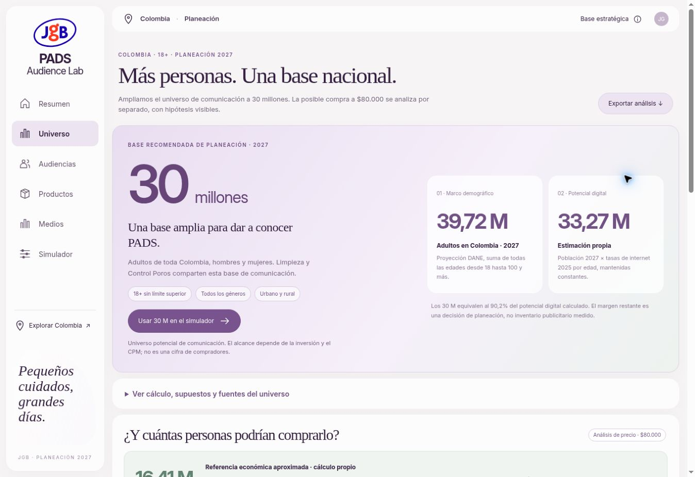

# PADS · Universo nacional y análisis de precio

Actualización: 7 de octubre de 2026. Horizonte de planeación: 2027.

## Universo de comunicación: 30 millones

Cobertura: toda Colombia, incluidas zonas urbanas, rurales y territorio insular; personas de 18 años en adelante, sin límite superior y todos los géneros. Los cinco clústeres describen hábitos; no son filtros de ciudad, género ni grupos exclusivos de personas.

| Concepto | Personas | Interpretación |
|---|---:|---|
| Adultos, proyección DANE 2027 | 39.721.750 | Marco demográfico |
| Potencial digital, cálculo propio | 33.274.171 | Aproximación con tasas de internet 2025 constantes |
| Universo nacional de comunicación | 30.000.000 | Decisión de planeación con margen; no alcance garantizado |
| Referencia económica, cálculo propio | 16.405.083 | Aproximación con proporción de clase media/alta; no compradores |

Las referencias digital y económica son cálculos independientes. No hay un cruce de personas por edad, ingresos e internet; no se presenta la referencia económica como un subconjunto observado de los 30 M.

### Población y uso de internet

[DANE, proyección nacional por edad simple 2018–2070](https://www.dane.gov.co/files/censo2018/proyecciones-de-poblacion/Nacional/PPED-AreaSexoEdadNac-2018-2070.xlsx), actualización 18 de julio de 2025. Hoja `PobNacionalxÁreaSexoEdad`, fila 39, año 2027 y área Total. Se suman edades 18–100+ en ambos sexos (columnas HA:KW para edades 0–100+). Hombres adultos: 19.166.107; mujeres adultas: 20.555.643. La clasificación por sexo del DANE no mide identidad de género. Total nacional de todas las edades: 53.712.233; los menores de 18 no integran la base.

[DANE, anexo TIC en hogares 2025](https://www.dane.gov.co/files/operaciones/TICH/anex-TICH-2025.xlsx), publicación 30 de septiembre de 2026. Hoja C.14, celdas P16:P18, porcentajes nacionales por edad. [Boletín, gráfico 30](https://www.dane.gov.co/files/operaciones/TICH/bol-TICH-2025.pdf).

| Grupo adulto | Población 2027 | Tasa TIC 2025 aplicada | Digital estimado |
|---|---:|---:|---:|
| 18–24 | 6.151.801 | 93,8184%* | 5.771.520 |
| 25–54 | 22.490.699 | 91,1285% | 20.495.430 |
| 55+ | 11.079.250 | 63,2463% | 7.007.221 |

*Para 18–24 se aproxima con la tasa publicada de 12–24. Los cálculos usan la precisión completa del anexo, no las tasas redondeadas de esta tabla.*

Sumar población por grupo × tasa correspondiente produce 33.274.171,1595196. Mantener las tasas de 2025 hasta 2027 no incorpora cambios de uso. Es una estimación propia, no una proyección oficial de usuarios digitales del DANE. Las fuentes y las huellas de los archivos están en `national-source-analysis.json`.

Los 30 M equivalen a 90,16% de la estimación digital; el margen de 9,84% es una decisión de planeación y no una medición de inventario. No certifica compradores, afinidad, intención ni disponibilidad en una plataforma. No se suman identidades o usuarios de distintos medios.

## Precio de referencia: $80.000

El precio aplica al producto analizado, con SKU y frecuencia de recompra por confirmar. No se asigna automáticamente a los pads de algodón. La transferencia de la hipótesis de precio a Control Poros es un supuesto visible, no una identificación confirmada del SKU.

[DANE, Clases Sociales 2025](https://www.dane.gov.co/files/operaciones/PM/cp-PMClasesSociales-2025.pdf), publicado 12 de agosto de 2026: clase media 38,0% y alta 3,3%, población de todas las edades. Aproximación propia: 39.721.750 adultos en 2027 × 0,413 = 16.405.082,75, redondeado 16.405.083. Supone igual proporción por edad y estabilidad 2025–2027; no es un cruce de microdatos ni capacidad efectiva de compra.

La calculadora mantiene separado el diagnóstico de presupuesto de la cantidad hipotética de personas:

- Costo mensual equivalente = precio / meses entre compras.
- Umbral aritmético de ingreso = costo mensual / proporción presupuestada.
- Con $80.000 cada mes y presupuesto del 5%: $1.600.000 por persona al mes; cada dos meses: $800.000. No es salario mínimo requerido ni una regla de asequibilidad.
- El límite inferior de clase media 2025 es $943.791 por persona del hogar al mes. No es salario individual ni ingreso disponible.
- Escenario condicionado = referencia económica × porcentaje conjunto supuesto de afinidad, acceso y disposición al precio. 20%: 3.281.017; 35%: 5.741.779; 50%: 8.202.542.

Estos porcentajes no están medidos: no son compradores, ventas ni intervalos de confianza. Cambiar el precio no inventa una elasticidad de demanda; modifica el diagnóstico de presupuesto. Faltan datos de SKU, distribución, categoría y disposición a pagar. La clase social no excluye compras ocasionales fuera de esos grupos. Estos escenarios no reducen automáticamente los 30 M de comunicación.

## Simulador y continuidad

La base inicial es 30 M compartidos para comunicación entre limpieza y Control Poros, sin personas exclusivas asignadas arbitrariamente. No supone que compren ambas líneas. El modelo de saturación usa presupuesto, CPM y reparto de inversión; deduplica la intersección y calcula frecuencia = impresiones / únicos. Doce olas reparten presupuesto uniforme. Los parámetros de medios son supuestos y el resultado no es alcance medido.

Con base totalmente compartida y CPM común, cambiar solo el reparto por producto conserva el alcance combinado y modifica los alcances por línea y el solapamiento. La inversión cero produce alcance, impresiones y frecuencia cero.

El botón de base nacional lleva 30 M al simulador. El botón del análisis de precio lleva solo la hipótesis condicionada a Control Poros y queda identificada en la exportación. Los CSV de mercado y escenario incluyen cobertura, edad, género, valores y fuentes; el de audiencias incluye el universo global sin atribuir tamaños a perfiles.

Se migra el antiguo ejemplo de 3 M a la base compartida de 30 M conservando presupuesto, CPM y mix. Se mantienen los escenarios personalizados válidos y el registro anterior; la nueva persistencia usa `pads-scenario-v3`. El máximo del simulador es la población adulta nacional proyectada, no la población de todas las edades.

## Verificación antes de publicar

13 pruebas aprobadas: demografía, tasas, referencia económica, sensibilidad de precio, migración, límites de población adulta y 101 repartos de inversión. Integración DOM aprobada: transferencia de ambos escenarios, conservación de presupuesto/CPM, cero inversión, restablecimiento, cinco clústeres nacionales, cinco guías, tres exportaciones, validación de errores y ausencia de excepciones de la aplicación.

## Verificación en producción

Publicado desde `main`, implementación `8fbd11a`; Vercel confirmó el despliegue completo. En https://pads-fawn.vercel.app/#market se verificó la base de 30 M y el detalle de fuentes. El botón nacional abrió el simulador con 30 M compartidos; inversión 100 M → 0 → 100 M COP produjo cero alcance y frecuencia al invertir cero. El explorador muestra cinco clústeres nacionales y se comprobó Deportistas. Sin errores de aplicación en la consola filtrada por dominio ni desbordamiento horizontal (viewport de 1363 px). No se realizó inspección visual móvil.

